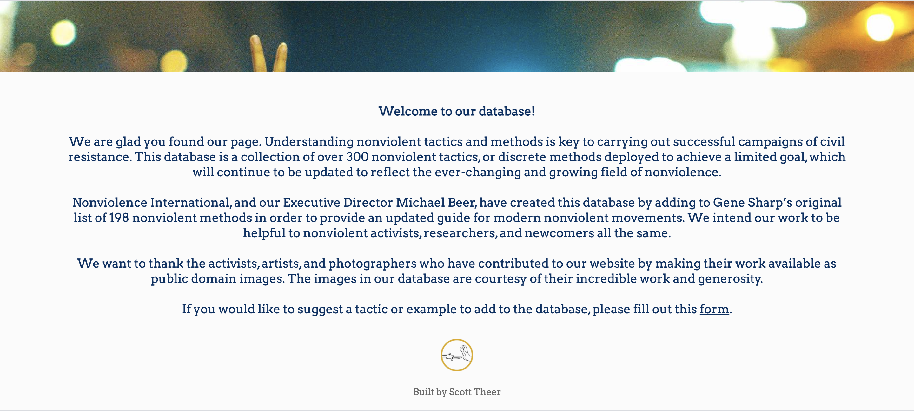
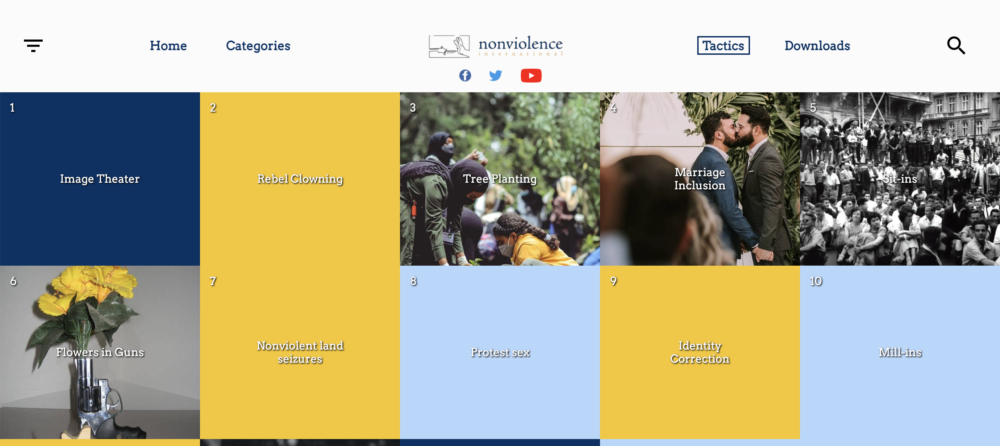
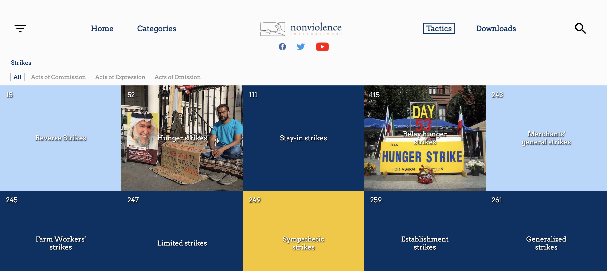
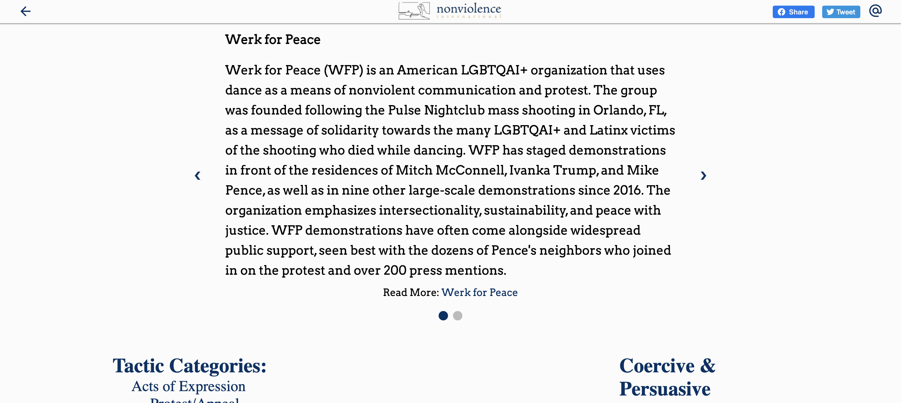
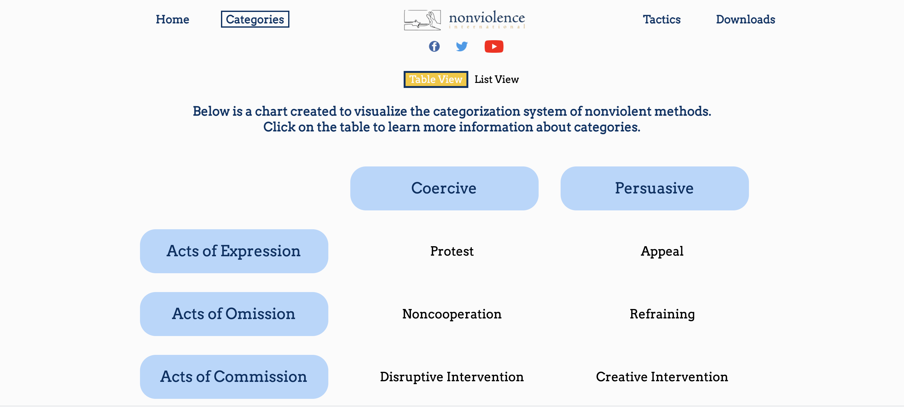
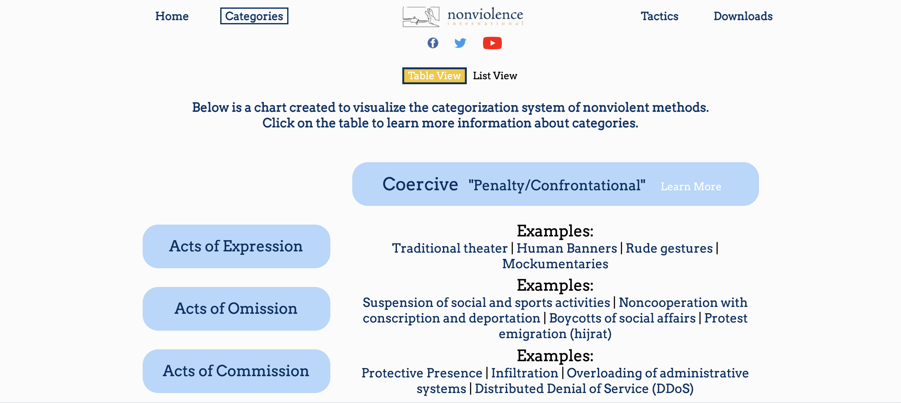
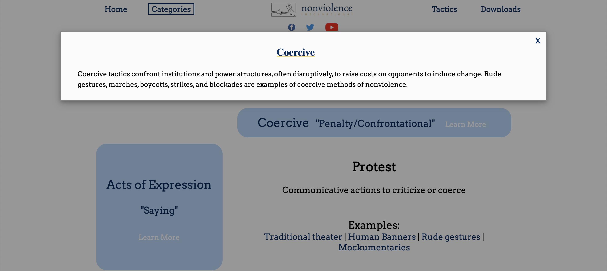
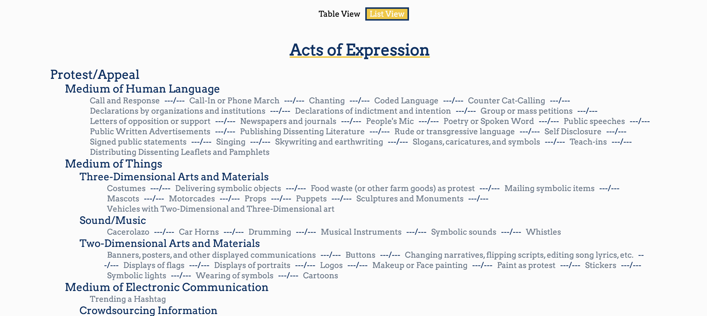
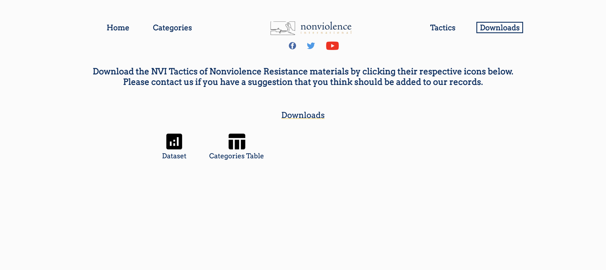

# NVITacticsDB

NVITacticsDB is an interactive NodeJS application built for Nonviolence International. It serves as the organization's database of nonviolent methods of civil resistance. The deployed site can be found at https://www.tactics.nonviolenceinternational.net/

## Installation

Clone this repository and run the below to install the required dependencies. Note that in order to run, the application requires a configuration file containing host information, a db connection, and google service/api/drive keys. 

```bash
npm install
```

## Usage and Images

Home page 



Tactics Page





Clicked Tactic Page



Categories Page





Downloads Page


## Contributing
This application is closed to contributions. If you'd like to contribute content to the site, please submit this [form](https://docs.google.com/forms/u/1/d/e/1FAIpQLSf88Fss7hdmp0blXDxmtNgimYXhh28Vgqj0CWyfm5hUDhJHpw/viewform?usp=send_form).

## License
[MIT](https://choosealicense.com/licenses/mit/)
